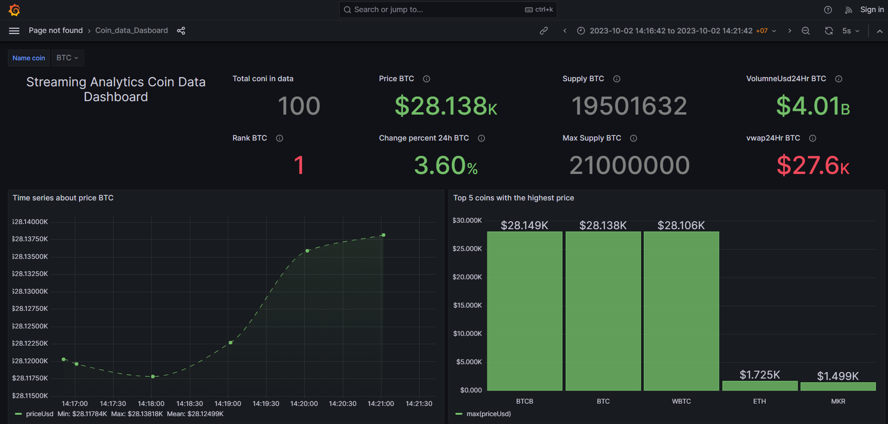

# Streaming-analytics.
## Problem description
Crypto is one of the popular investment markets. The project builds a pipeline with functions such as getting data, processing, storing and displaying crypto data real time.
## About dataset
 - Data is collected by calling Api. The API returns data as json in real time.
 - Data contains information about crypto:
    - Timestamp: data collection time
    - id: unique identifier for asset
    - rank: rank is in ascending order - this number is directly associated with the marketcap whereas the highest marketcap receives rank 1
    - symbol: most common symbol used to identify this asset on an exchange
    - name: proper name for asset
    - supply: available supply for trading
    - maxSupply: total quantity of asset issued
    - marketCapUsd: supply x price
    - volumeUsd24Hr: quantity of trading volume represented in USD over the last 24 hours
    - priceUsd: volume-weighted price based on real-time market data, translated to USD
    - changePercent24Hr: the direction and value change in the last 24 hours
    - vwap24Hr: volume Weighted Average Price in the last 24 hours
## Technical and data pipeline
 - Kafka
 - Data wareshouse: Clickhouse
 - Visualization: Grafana
 - Workflow orchestration: Airflow
  

## Dashboard

